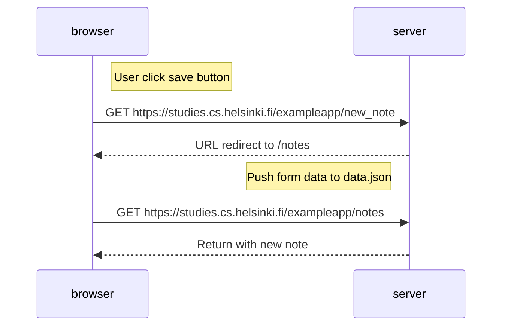

```mermaid
sequenceDiagram
    participant browser
    participant server

    Note right of browser: User click save button
    browser->>server: GET https://studies.cs.helsinki.fi/exampleapp/new_note
    server-->>browser: URL redirect to /notes
    Note left of server: Push form data to data.json

    browser->>server: GET https://studies.cs.helsinki.fi/exampleapp/notes
    server-->>browser: Return with new note

```
